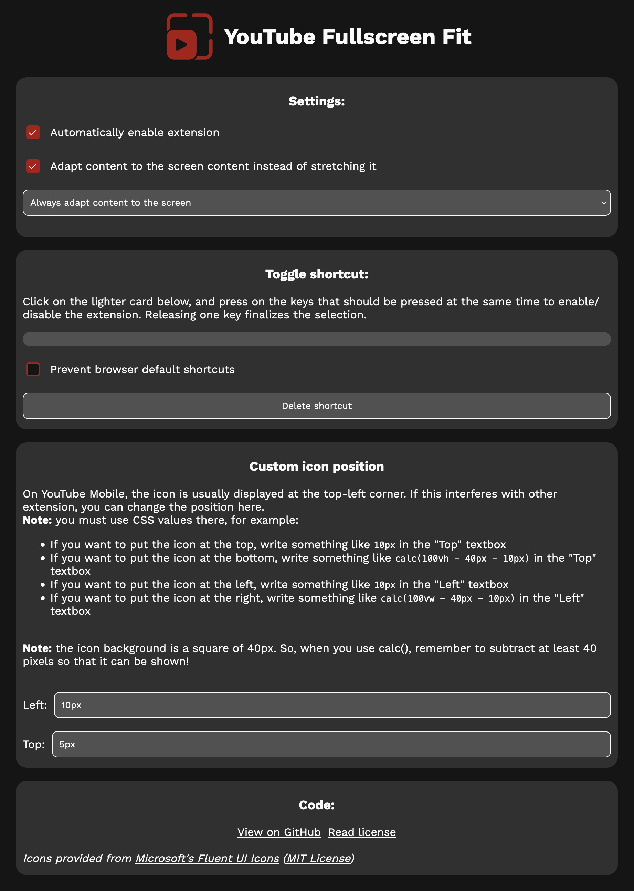

# youtube-fullscreen-fit
Make the YouTube and Invidious player fill all of your screen while viewing a video in fullscreen mode.

https://github.com/user-attachments/assets/7b901f51-336a-49fe-95bb-4eb1356555a0


## Installation
First, download the [.zip file](https://codeload.github.com/Dinoosauro/youtube-fullscreen-cover/zip/refs/heads/main) of this repository. Then, follow the instructions of your browser.
### Chromium:
Go to the ```chrome://extensions``` page, and enable the ```Developer mode``` slider. Extract the .zip file, and then on your browser click on the ```Load unpacked extension``` button. Choose the directory where you've extracted the .zip file, and the extension will be installed.

### Firefox

If you're using Firefox, download it from Firefox Addons: https://addons.mozilla.org/firefox/addon/youtube-fullscreen-fit/

You can also sideload it:
Go to ```about:debugging#/runtime/this-firefox```, and click on the ```Load Temporary Add-on``` button. Choose the .zip file, and the extension will be installed. Now, go to the YouTube webpage. Click on the extension icon on the top bar, right click on ```YouTube Fullscreen Fit``` and choose ```Always enabled for youtube.com```. 

## Usage
After the extension has been installed (and the permission to access YouTube has been granted), videos in full screen mode will automatically be resized to fit all the screen. You'll find a button to make the video back to its original size (or to enlarge it in the opposite case):
- At the bottom of the player UI (at the left of the subtitle icon) if you're using YouTube on desktop;
- Or in the top-right corner (at the left of the autoplay icon) if you're using YouTube on mobile.

If you want to enable manually the zoom, you can do that by clicking on the extension icon and by disabling the "Automatically enable extension" checkbox. You can also choose to strecth the video instead of zooming it (idk why you should want to do that, but it's possible).

You can also choose to automatically scale the video only if the screen height isn't completely covered (the option is: `Adapt content to the screen only if the video height doesn't completely cover the screen`). This means that the video will be filled only if there are black bars at the top/bottom of the screen. It might be useful to enable this if you listen to music using YouTube's auto generated videos. You can do the same thing also for the opposite case.

### UI Screenshot



